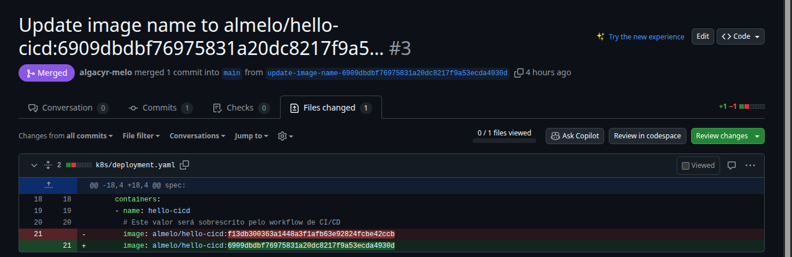

# Hello, CI/CD

Aplicação simples em **FastAPI**, utilizada como base para projeto de **CI/CD** com **GitHub Actions**, **Docker Hub** e **Argo CD**.

## Instruções para deploy local

### Pré-requisitos

- Cluster Kubernetes local (Rancher Desktop, Minikube, Docker Desktop)
- kubectl

### Método 1: Usando arquivos locais

1. Clone o repositório de manifestos:
    ```bash
    git clone https://github.com/algacyr-melo/hello-cicd-manifests.git
    cd hello-cicd-manifests
    ```

2. Aplique todos os manifestos:
    ```bash
    kubectl apply -f k8s/
    ```

### Método 2: Usando URLs remotas (sem clonar)

```bash
kubectl apply -f \
https://raw.githubusercontent.com/algacyr-melo/hello-cicd-manifests/refs/heads/main/k8s/deployment.yaml \
-f https://raw.githubusercontent.com/algacyr-melo/hello-cicd-manifests/refs/heads/main/k8s/service.yaml
```

### Verificando o deploy

1. Confira se os recursos foram criados:

    ```bash
    kubectl get all -l app=hello-cicd
    ```

2. Acesse a aplicação em: [http://localhost:8080](http://localhost:8080)

   - *O **Rancher Desktop** vai expor automaticamente o Service (LoadBalancer) via localhost.*

    - **Dependendo do seu setup, pode ser necessário o uso do port-forward**
        ```bash
        kubectl port-forward svc/hello-cicd 8080:8000
        ```

## Entregas do Projeto

### Build e push da imagem no Docker Hub


*Repositório com imagens enviadas via workflow*

### Atualização automática do manifest


*Informação de arquivos alterados no PR*

### Argo CD sincronizado com o app


*UI do Argo com informações do deploy local após rolling update*

### App em execução no cluster local


*Deployment, Service, ReplicaSets e Pods do cluster filtrados por label*

### Acessando App


*Requisição HTTP via browser*


*Requisição HTTP via curl*
